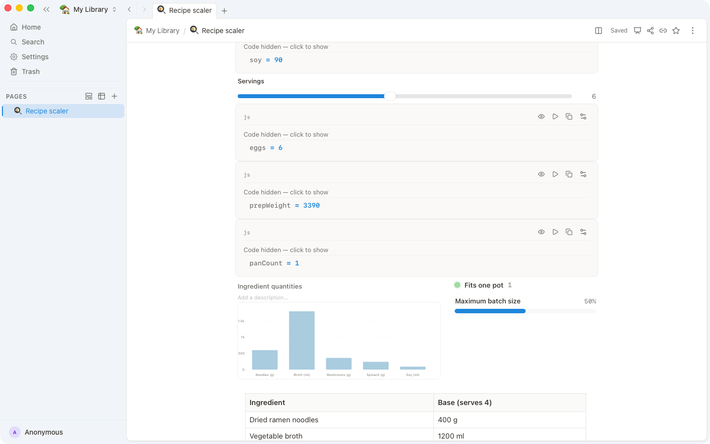

<div align="center">


# OpenBook

**Notes, databases, and interactive pages that work offline.**

[](LICENSE)
[](https://github.com/lab255/OpenBook/releases/latest)


**[Download](#download) · [open.book.pub](https://open.book.pub) · [Templates](#templates) · [Contributing](#contributing)**


</div>

## Pick your path

🟢 **Just want a notebook that works offline?** → [Download OpenBook](#download)

🔵 **Want pages that compute as you edit?** → See it [in action](#in-action) or start from a [template](#templates)

🟣 **Want the internals—SDK, plugins, and local-first sync?** → Go to [For developers](#for-developers) or [Contributing](#contributing)

## In action

<table>
<tr>
<td width="45%"></td>
<td width="55%">

### 🍳 Scale a recipe live

Move the servings slider and the ingredient table and chart recompute together. **Change one input; every connected block stays in sync.**

</td>
</tr>
</table>

<table>
<tr>
<td width="55%">

### ⌨️ Add blocks without leaving the keyboard

Type `/` to insert text, media, databases, controls, charts, and more. **Build structured pages in the same flow as writing.**

</td>
<td width="45%"></td>
</tr>
</table>

<table>
<tr>
<td width="45%"></td>
<td width="55%">

### 🗂️ Switch the view, not the data

Show one database as a grid, board, calendar, timeline, or map, with filters and sorting for each view. **Keep one source of truth for different workflows.**

</td>
</tr>
</table>

<table>
<tr>
<td width="55%">

### 🎤 Present from the page

Turn a page into a clean audience view while keeping speaker notes and a timer close by. **Write and present from the same document.**

</td>
<td width="45%"></td>
</tr>
</table>

<table>
<tr>
<td width="45%"></td>
<td width="55%">

### 🛜 Work locally, share when you choose

Edits land in a local database first, so the app keeps working offline; sync and collaboration are optional. **Your notebook does not depend on a connection.**

</td>
</tr>
</table>

## Templates

The gallery ships with ready-made interactive templates: **recipe scaler**, grocery price tracker, task board, roadmap, and pitch deck. Use one as-is or open it up to see how its controls, data, and views connect.

## Download

Download the [latest release](https://github.com/lab255/OpenBook/releases/latest). OpenBook makes automatic local backups on every platform; macOS, Windows, and the Linux AppImage also update automatically.

| Platform | Download | Notes |
| --- | --- | --- |
| macOS | `OpenBook_<ver>_aarch64.dmg` (Apple Silicon) or `OpenBook_<ver>_x64.dmg` (Intel) | Signed and notarized. |
| Windows | `OpenBook_<ver>_x64-setup.exe` (recommended) or `.msi` | Windows may show SmartScreen; choose **More info → Run anyway**. Signed builds are planned. |
| Linux | `.AppImage`, `.deb`, or `.rpm` | 64-bit x86 (x86_64). Choose the package for your distribution. |

## Sharing and sync

OpenBook works offline with no account, and edits are written to its local database first. For sync or collaboration, self-host the server or publish a library to **book.cloud**; book.cloud requires a free account.

## For developers

OpenBook includes an SDK and plugin system, with a local-first desktop client and optional sync server. See [ARCHITECTURE.md](ARCHITECTURE.md), the [`packages`](packages/) directory, and [DEVELOPMENT.md](DEVELOPMENT.md) for the system design, code layout, and setup instructions.

Prerequisites are Node.js `^22.14.0 || >=24.10.0`, pnpm, Bun `1.3.14`, and a Rust toolchain.

```sh
corepack enable
pnpm install
pnpm dev
```

## Contributing

Issues and contributions are welcome. Read [CONTRIBUTING.md](CONTRIBUTING.md) before opening a change, and report security issues privately as described in [SECURITY.md](SECURITY.md).

## License

OpenBook is released under the [MIT License](LICENSE).
