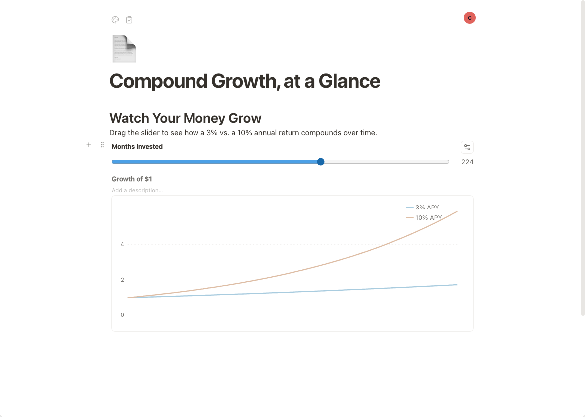
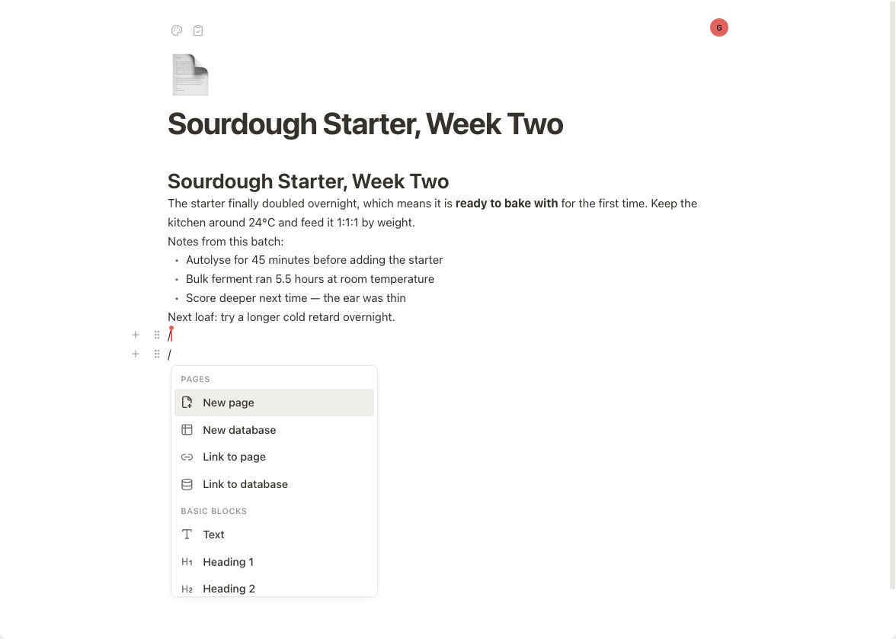
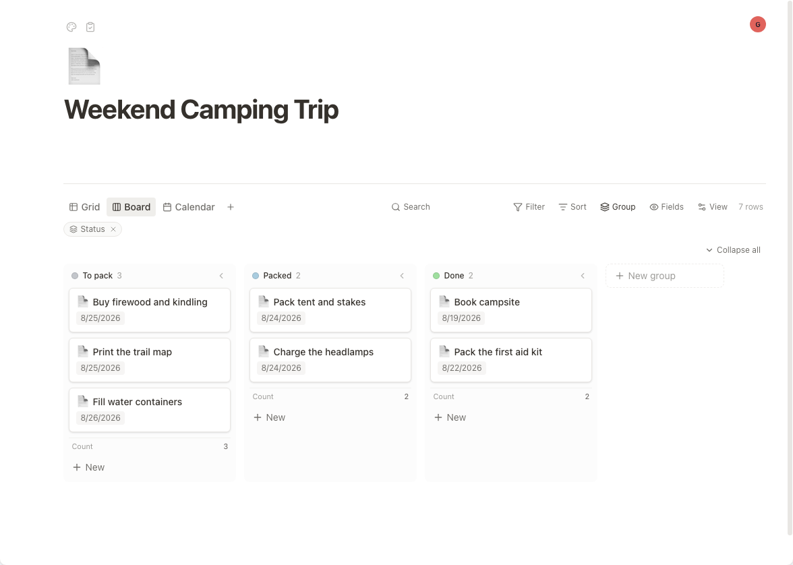
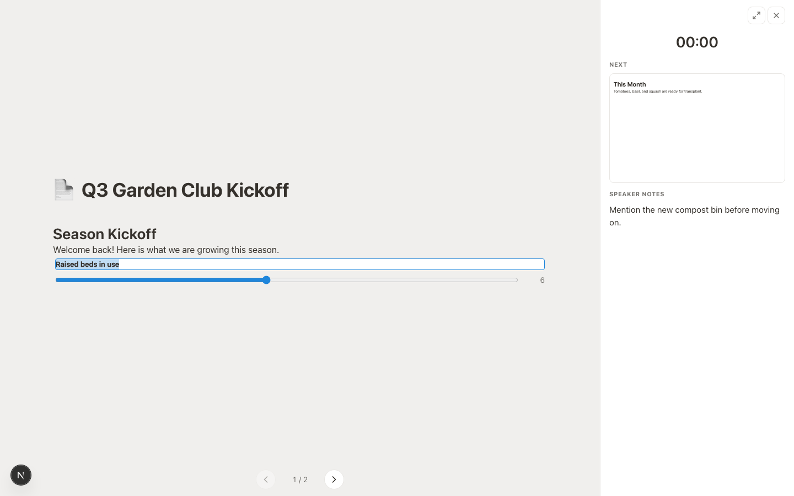
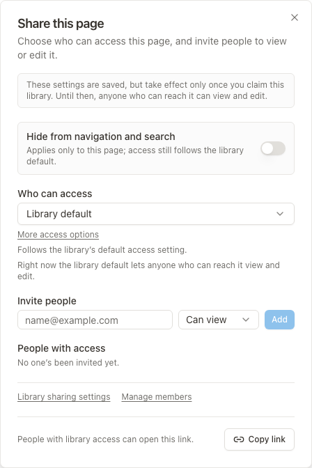
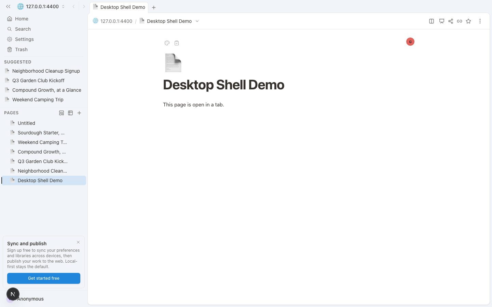

# OpenBook

**A safe space for your notes — free, open source, and yours offline.**

<div align="center">

**[Download](https://github.com/lab255/OpenBook/releases/latest) | [Website](https://open.book.pub) | [Features](#features)**

</div>



## For everyone

OpenBook is a private, open-source home for notes, databases, and interactive pages. It works offline and keeps your work on your machine; an account, sharing, and sync are optional.

Download the [latest release](https://github.com/lab255/OpenBook/releases/latest) for your platform:

- **macOS:** Choose `OpenBook_<ver>_aarch64.dmg` for Apple Silicon or `OpenBook_<ver>_x64.dmg` for Intel. The app is signed and notarized, so it opens normally.
- **Windows:** Prefer `OpenBook_<ver>_x64-setup.exe`; an `.msi` installer is also available. Windows may show a SmartScreen warning for now—select **More info → Run anyway**. Signed builds are on the way.
- **Linux:** Choose the `.AppImage`, `.deb`, or `.rpm` package for your system.

OpenBook updates automatically and makes automatic local backups out of the box.

## Features

- Build calculators, charts and dashboards that update as you type — and see how they're wired.
- Put spreadsheets inside your pages. Filter, sort, and switch between table, board, calendar, timeline, map and more.
- Keep pages inside pages. Open them in tabs, windows, or side by side.
- Deleted something? Get it back from the Trash.
- Export self-contained HTML that stays interactive offline.
- Add custom blocks, commands, and integrations with plugins.

Write naturally, then use the slash menu to add structured blocks.



Turn the same database into focused grid, board, calendar, timeline, or map views.



Build reactive pages where controls update calculators, charts, and dashboards instantly.


Present a page with speaker notes, a timer, and a clean audience view.



Share a page with the people you choose and control their access.



Keep pages organized in desktop tabs while navigating your library.



See the [full feature tour](https://open.book.pub).

## Sharing and sync

OpenBook works offline with no account. For sync or collaboration, self-host the server or publish a library to [book.cloud](https://open.book.pub). book.cloud requires a free account.

## For developers

Issues and contributions are welcome. Read [CONTRIBUTING.md](CONTRIBUTING.md) for the contribution guidelines and [DEVELOPMENT.md](DEVELOPMENT.md) for the full development guide.

Prerequisites: Node.js `^22.14.0 || >=24.10.0`, pnpm, Bun `1.3.14`, and a Rust toolchain.

```sh
corepack enable
pnpm install
pnpm dev
```

For the system design and code layout, see [ARCHITECTURE.md](ARCHITECTURE.md) and the [`packages`](packages/) directory. Report security issues privately as described in [SECURITY.md](SECURITY.md).

## License

OpenBook is released under the [MIT License](LICENSE).
