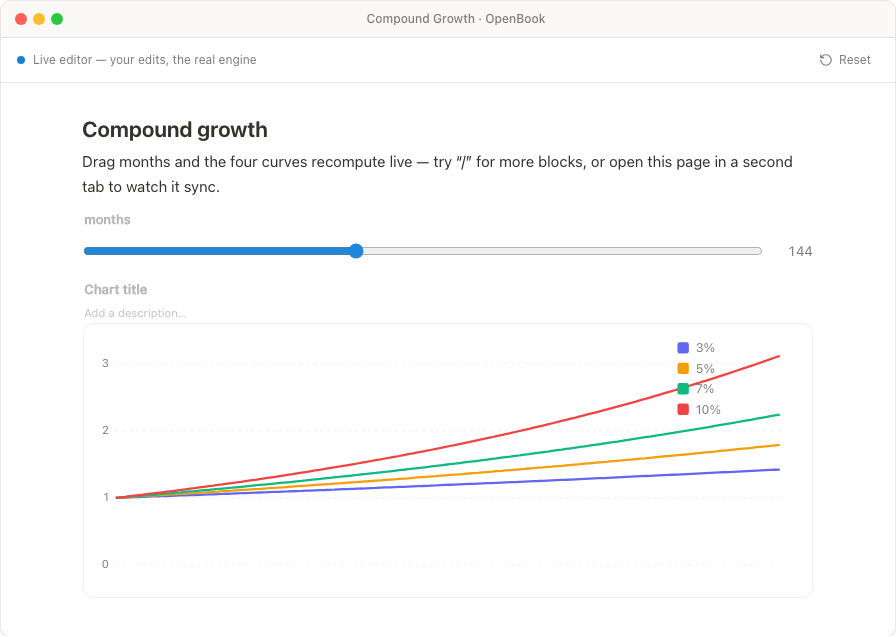
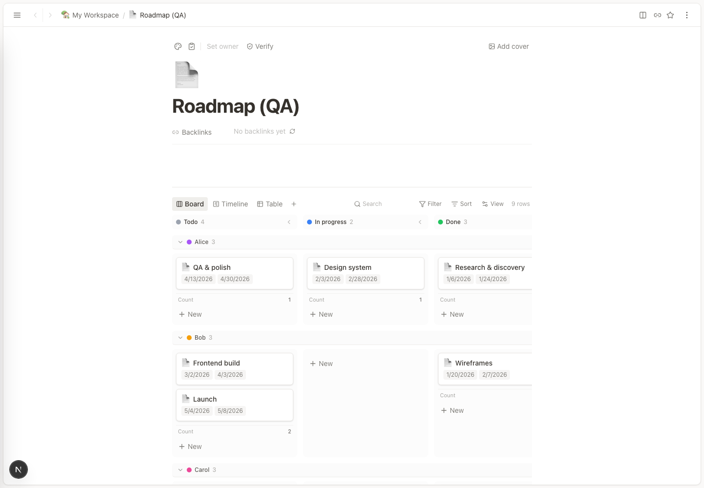
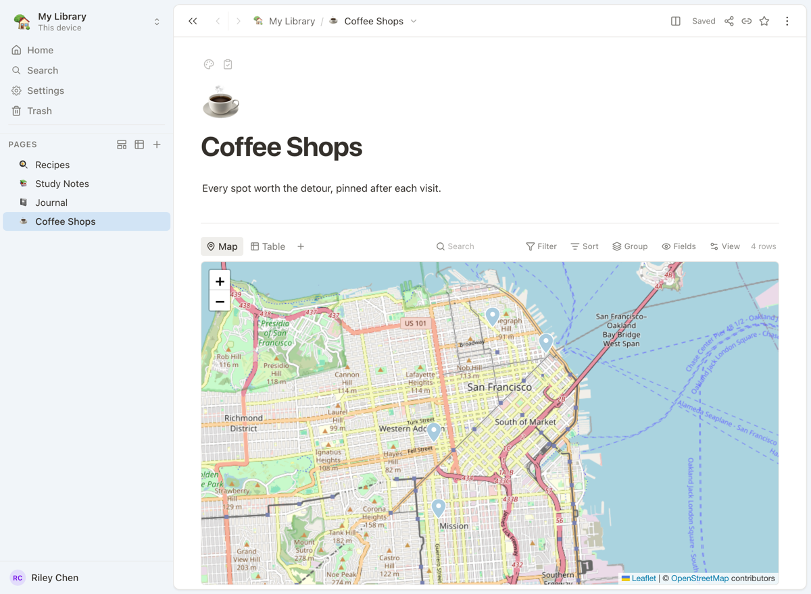

# OpenBook

**A free, open-source, local-first app for notes, databases, and documents that
compute.**

Your work lives on your machine. OpenBook works offline. Sync and self-hosting
are optional.

## Features

- Build calculators, charts, and dashboards from reactive blocks. Inspect their
  live dataflow.
- Put typed databases inside pages. Filter, sort, and switch views.
- Nest pages. Open them in tabs, windows, or a split view.
- Recover deleted pages from Trash.
- Export self-contained HTML that stays interactive offline.
- Add custom blocks, commands, and integrations with signed plugins.

  
  

See the [full feature tour](https://open.book.pub).

## Download

Get the [latest release](https://github.com/eliotlim/OpenBook/releases/latest).

- macOS: Apple Silicon and Intel
- Linux: `.deb`, `.rpm`, and `.AppImage`
- Windows: `.msi` and `.exe`

## Sharing and sync

OpenBook works offline with no account. For sync or collaboration, self-host the
server or publish a library to **book.cloud**. book.cloud requires a free account.

## Contributing

Issues and contributions are welcome. Code quality is the bar. AI-generated PRs
are accepted, but must meet the house standard. A CLA is required. See
[CONTRIBUTING.md](CONTRIBUTING.md).

## License

OpenBook is released under the [MIT License](LICENSE).
